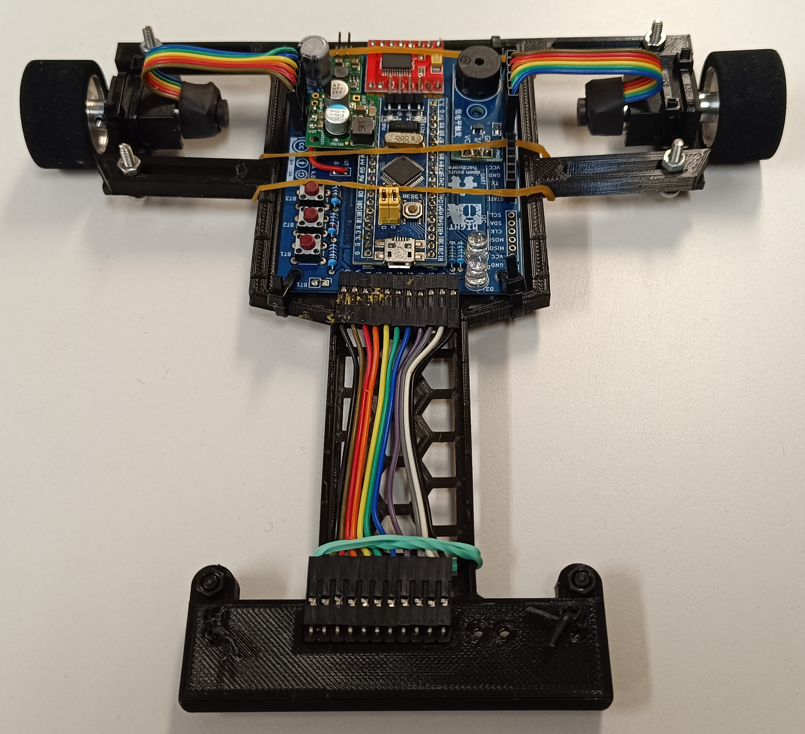
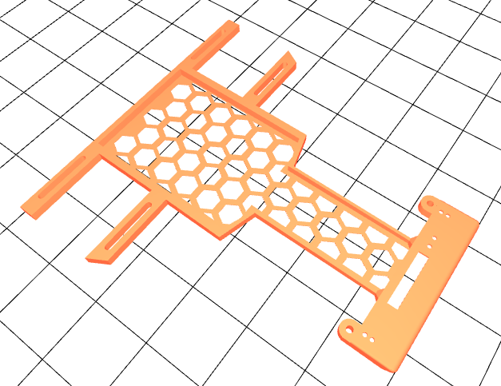
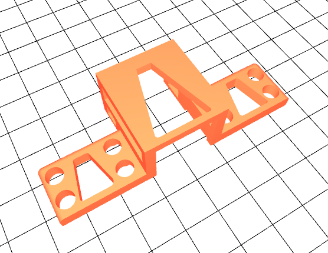
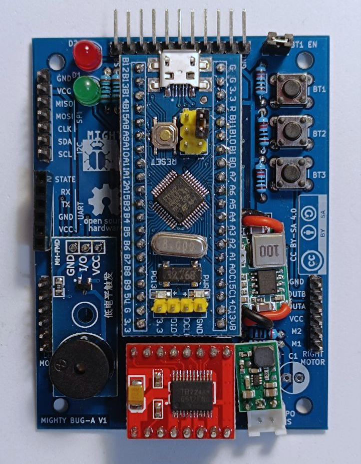

# RustyBugA hardware

## Table of contents

* [Motion](#motion)
* [Chassis](#chassis)
* [Sensors](#sensors)
  * [Line sensors](#line-sensors)
  * [Encoders](#encoders)
* [Main board](#main-board)
    * [LEDs](#leds)
    * [Buttons](#buttons)
    * [Music](#music)
    * [Power supply](#power-supply)
    * [MCU](#mcu)
    * [Pinput](#pinout)

## Motion

RustyBuga uses two DC motors from Pololu in an N20 form factor with a gear reduction of 5 to 1. The motors are rated for 6V but can be safely supplied with up to 9V without damaging them.

Both motors are connected to a TB6612FNG two channel motor driver that can output a maximum current of 1.2 A (with peaks up to 3A). The driver has two main functions:

* Let the MCU easily change the direction of rotation of the motors by using just two pins.
* Let the MCU control the speed of the motor with a low power signal and amplify it to supply the motor with enough current and voltage.

## Chassis

The chassis is a 3D printed structure that holds all the pieces of the robot together adding as little weight as possible. In the following repository, you can find the designs used in our previous robots:

https://gitlab.com/punkto/line_follower_3d_designs

To build a robot you need the base of the chassis:

And two motor holders. All the pieces can be put together using nylon screws to make it as lightweight as possible.

## Sensors

### Line sensors

The board is connected to a QTR-8A Reflectance sensor array. This board features 8 line sensors place in a straight line with a spacing of 9.525 mm between sensors. The board is connected to the MCU ADC so the analog values generanted by the sensors can be digitized and used in the control software.

### Encoders

The motors have an extended rear axle where a magnetic encoder can be plugged. Each encoder outputs 12 pulses with each motor axle revolution. This means that, considering the geared reduction, the encoder outputs a total of 60 pulses per wheel revolution.

## Main board

The RustyBugA mainboard is designed as a carrier board where different pre-assembled modules are plugged so they can be easily replaced if needed. The complete board has the following components:
 * MCU: STM32F103 Bluepill module
 * Buzzer: Passive buzzer module.
 * Motor driver: TB6612FNG motor driver module.
 * Step down: MP2307DN 3.3V step down regulator module.
 * Step up: SC4503 9V step up regulator module.
 * 2 LEDs
 * 3 Buttons

### Leds

The board includes two LEDs that can be programmed to tell the user about the status of the robot.

### Buttons

The board includes 3 pushbuttons that can be programmed to interact with the robot.

One of the buttons is connected to a pin shared with the SPI port. In case this port is used, jumper BT1_EN must be opened making the button unusable.

### Music

The board includes a buzzer that can be programmed to generate different sounds and melodies that can tell the user information about the status of the robot.

### Power Supply

The RustyBugA board is designed to be powered with a 2S LiPo battery. This means a maximum input voltage of 8.4V when the battery is fully charged and a minimum of 3.6V when the battery is discharged.

The MP2307DN regulator is responsible to convert from the battery voltage down to a 3.3V source to power all the electronics (MCU, encoders, LEDs, buzzer, buttons, sensors, etc).

A separate voltage source of 9V is provided through the SC4503 step up module to supply the motors. While the motors could be powered directly from the battery, the voltage reaching the motors would be constantly dropping making their behaviour difficult to predict. Supplying a fixed voltage simplifies the control software as the motors will keep the same behaviour through the whole discharge cycle of the battery.

### MCU

The RustyBugA mainboard uses an STM32F103C8T6 microcontroller in a bluepill module. The MCU is a 72 MHz single core ARM-Cortex-M3 with 64 Kbytes of flash memory.

The manual for this microcontroller can be found at: https://www.st.com/resource/en/reference_manual/rm0008-stm32f101xx-stm32f102xx-stm32f103xx-stm32f105xx-and-stm32f107xx-advanced-armbased-32bit-mcus-stmicroelectronics.pdf

### Connection ports

* **Line sensor array port:** Connect the external array of line sensors to the MCU ADC. Provide 3.3V to supply the sensors as well as an enable signal.

* **Left and right motor ports:** Connect external motors with encoders. Provide 3.3V to supply the external encoders as well as the 9V signal to power the motors.

* **Battery port:** Power supply port to the board. It is designed to accept a 2S lipo battery.

* **Communications port:** Designed to plug in an HC-05 Bluetooth adapter to have remote telemetry from the robot for debugging purposes.

* **Expansion port:** Designed to connect expansion boards to the robot for future uses. Includes an SPI and I2C port that can be used to connect other hardware to the MCU.

### Pinout

